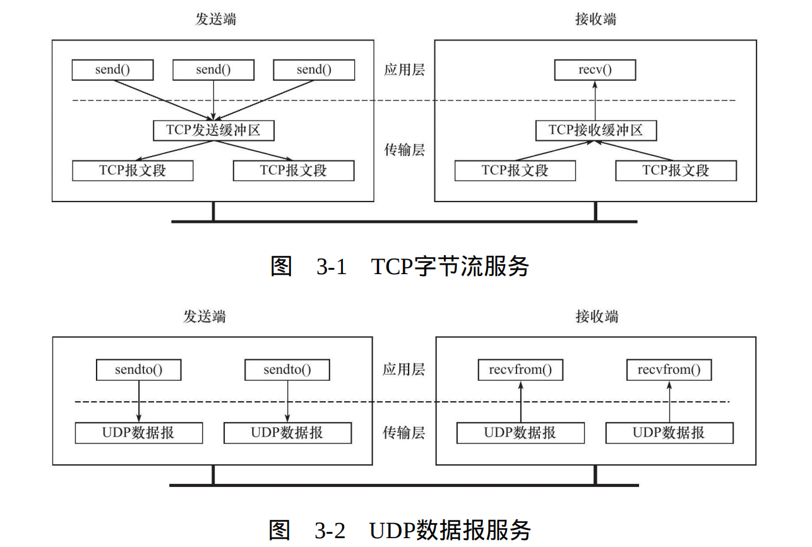
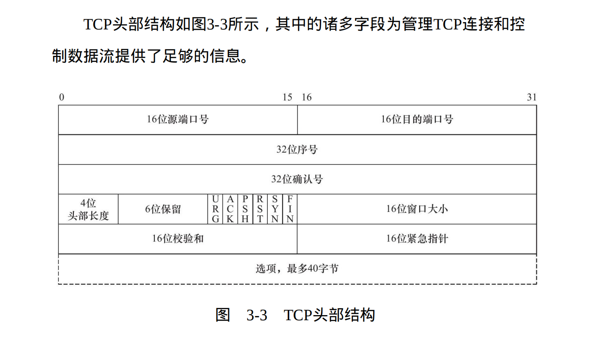
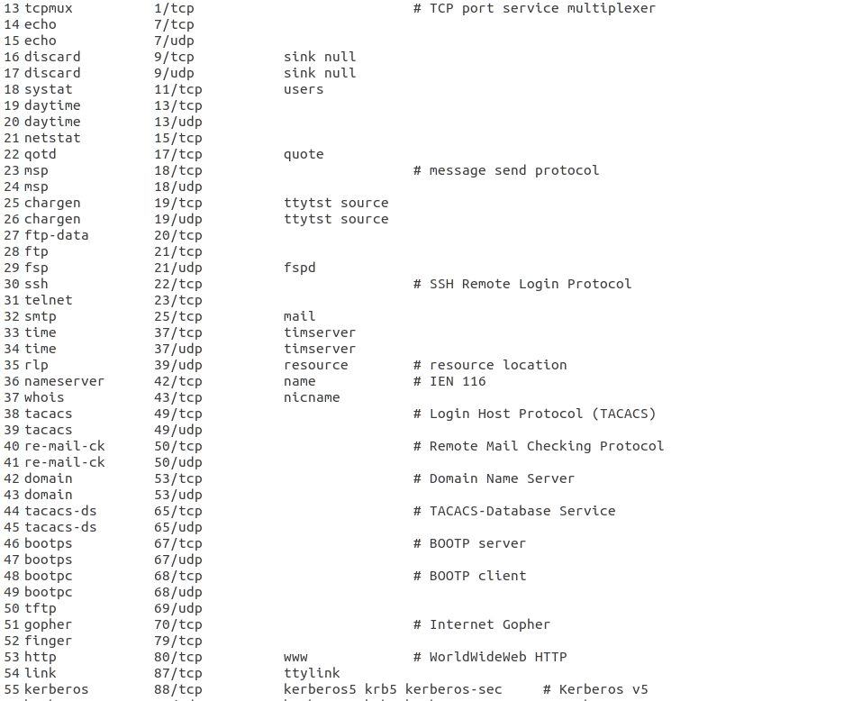
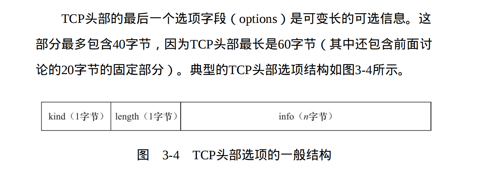
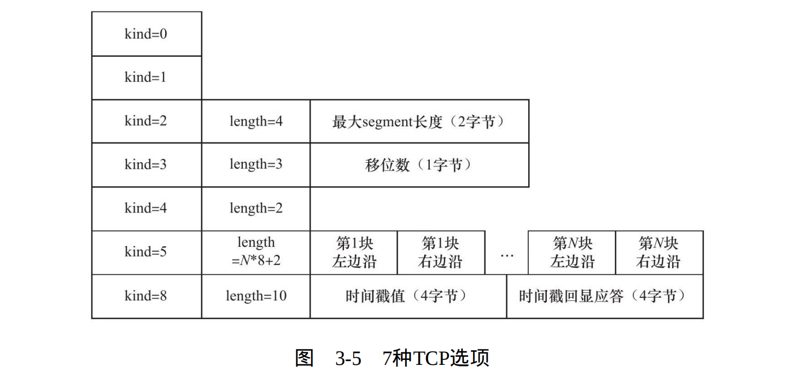

# TCP协议详解
## TCP服务的特点
传输层协议主要有两个：`TCP协议`和`UDP`协议。`TCP协议`相对于`UDP协议`的特点是：面向连接、字节流和可靠传输。

> 使用TCP协议通信的双方必须先建立连接，然后才能开始数据的读写。双方都必须为该连接分配必要的内核资源，以管理连接的状态和连接上数据的传输。

> TCP连接是`全双工的`，即双方的数据读写可以通过一个连接进行。完成数据交换之后，通信双方都必须断开连接以释放系统资源。

> TCP协议的这种连接是`一对一`的，所以基于广播和多播（目标是多个主机地址）的应用程序不能使用TCP服务。而无连接协议UDP则非常适合于广播和多播。

> 字节流服务和数据报服务的区别。
这种区别对应到实际编程中，则体现为通信双方是否必须执行相同次数的
读、写操作（当然，这只是表现形式）。当发送端应用程序连续执行
多次写操作时，TCP模块先将这些数据放入TCP发送缓冲区中。当TCP
模块真正开始发送数据时，发送缓冲区中这些等待发送的数据可能被
封装成一个或多个TCP报文段发出。因此，`TCP模块发送出的TCP报文
段的个数和应用程序执行的写操作次数之间没有固定的数量关系`。

> 综上所述，发送端执行的写操作次数和接收端执行的读操作次数
之间`没有任何数量关系`，这就是`字节流`的概念：应用程序对数据的发
送和接收是没有边界限制的。UDP则不然。发送端应用程序每执行一
次写操作，UDP模块就将其封装成一个UDP数据报并发送之。接收端
必须及时针对每一个UDP数据报执行读操作（通过recvfrom系统调
用），否则就会丢包（这经常发生在较慢的服务器上）。并且，`如果
用户没有指定足够的应用程序缓冲区来读取UDP数据，则UDP数据将
被截断`。

> 图3-1和图3-2显示了TCP字节流服务和UDP数据报服务的上述区别。两图中省略了传输层以下的通信细节。



> TCP传输是`可靠`的。首先，TCP协议采用`发送应答机制`，即发送端
发送的每个TCP报文段都必须得到接收方的应答，才认为这个TCP报文
段传输成功。其次，TCP协议采用`超时重传机制`，发送端在发送出一个
TCP报文段之后启动定时器，如果在定时时间内未收到应答，它将重发
该报文段。最后，因为TCP报文段最终是以IP数据报发送的，而IP数据
报到达接收端可能乱序、重复，所以TCP协议还会对接收到的TCP报文
段`重排、整理`，再交付给应用层。

## TCP头部结构


### 端口号(bit) 16bit
```
16位端口号（port number）：
告知主机该报文段是来自哪里（源端口）以及传给哪个上层协议或应用程序（目的端口）的。

进行TCP通信时，客户端通常使用系统自动选择的临时端口号，而服务器则使用知名服务端口号。

所有知名服务使用的端口号都定义在/etc/services文件中。
```


### 序号(bit) 32bit
```
32位序号（sequence number）：一次TCP通信（从TCP连接建立到断开）过程中某一个传输方向上的字节流的每个字节的编号。

假设主机A和主机B进行TCP通信，A发送给B的第一个TCP报文段中，序号值被系统初始化为某个随机值ISN（Initial Sequence Number，初始序号值）。
那么在该传输方向上（从A到B），后续的TCP报文段中序号值将被系统设置成ISN加上该报文段所携带数据的第一个字节在整个字节流中的偏移。

例如，某个TCP报文段传送的数据是字节流中的第1025～2048字节，那么该报文段的序号值就是ISN+1025。
另外一个传输方向（从B到A）的TCP报文段的序号值也具有相同的含义。
```

### 确认号(bit) 32bit
```
32位确认号（acknowledgement number）：用作对另一方发送来的TCP报文段的响应。

其值是收到的TCP报文段的序号值加1。假设主机A和主机B进行TCP通信，那么A发送出的TCP报文段不仅携带自己的序
号，而且包含对B发送来的TCP报文段的确认号。

反之，B发送出的TCP报文段也同时携带自己的序号和对A发送来的报文段的确认号。
```

### 头部长度(bit) 4bit
```
4位头部长度（header length）标识该IP头部有多少个32 bit字（4字节）。
4(字节）*5行 = 20字节
而选项最多40字节
可以推出TCP头部最长60字节
```

### 标志位(bit) 6bit
```
URG标志，表示紧急指针（urgent pointer）是否有效。

ACK标志，表示确认号是否有效。我们称携带ACK标志的TCP报文段为确认报文段。

PSH标志，提示接收端应用程序应该立即从TCP接收缓冲区中读走数据，为接收后续数据腾出空间（如果应用程序不将接收到的数据
读走，它们就会一直停留在TCP接收缓冲区中）。

RST标志，表示要求对方重新建立连接。我们称携带RST(reset)标志的TCP报文段为复位报文段。

SYN标志，表示请求建立一个连接。我们称携带SYN标志的TCP报文段为同步报文段。

FIN标志，表示通知对方本端要关闭连接了。我们称携带FIN标志的TCP报文段为结束报文段。
```

### 窗口大小(bit) 16bit
```
16位窗口大小（window size）: 是TCP流量控制的一个手段。

这里说的窗口，指的是接收通告窗口（Receiver Window，RWND）。
它告诉对方本端的TCP接收缓冲区还能容纳多少字节的数据，这样对方就可以控制发送数据的速度。
```

## TCP头部选项（了解）

> TCP头部的最后一个选项字段（options）是可变长的可选信息。这部分最多包含40字节，因为TCP头部最长是60字节（其中还包含前面讨
论的20字节的固定部分）。


```
选项的第一个字段kind说明选项的类型。有的TCP选项没有后面两个字段，仅包含1字节的kind字段。

第二个字段length（如果有的话）指定该选项的总长度，该长度包括kind字段和length字段占据的2字节。

第三个字段info（如果有的话）是选项的具体信息。常见的TCP选项有7种，如图3-5所示。
```


```
kind=0是选项表结束选项。

kind=1是空操作（nop）选项，没有特殊含义，一般用于将TCP选项的总长度填充为4字节的整数倍。

kind=2是最大报文段长度选项。TCP连接初始化时，通信双方使用该选项来协商最大报文段长度（Max Segment Size，MSS）。
TCP模块通常将MSS设置为（MTU-40）字节（减掉的这40字节包括20字节的TCP头部和20字节的IP头部）。

这样携带TCP报文段的IP数据报的长度就不会超过MTU【最大传输单元（Maximum Transmission Unit，MTU）】（假设TCP头部和IP头部都不包含选项字段，并且这也是一般情况），
从而避免本机发生IP分片。对以太网而言，MSS值 是1460（1500-40）字节。

kind=3是窗口扩大因子选项。TCP连接初始化时，通信双方使用该选项来协商接收通告窗口的扩大因子。
在TCP的头部中，接收通告窗口大小是用16位表示的，故最大为65 535字节，但实际上TCP模块允许的接收通告窗口大小远不止这个数（为了提高TCP通信的吞吐量）。
窗口扩大因子解决了这个问题。假设TCP头部中的接收通告窗口大小是N，窗口扩大因子（移位数）是M，那么TCP报文段的实际接收通告窗口大
小是N乘2M，或者说N左移M位。注意，M的取值范围是0～14。
我们可以通过修改/proc/sys/net/ipv4/tcp_window_scaling内核变量来启用或关闭窗口扩大因子选项。

kind=4是选择性确认（Selective Acknowledgment，SACK）选项。
TCP通信时，如果某个TCP报文段丢失，则TCP模块会重传最后被确认的TCP报文段后续的所有报文段，这样原先已经正确传输的TCP报文段
也可能重复发送，从而降低了TCP性能。SACK技术正是为改善这种情况而产生的，它使TCP模块只重新发送丢失的TCP报文段，不用发送所
有未被确认的TCP报文段。选择性确认选项用在连接初始化时，表示是否支持SACK技术。我们可以通过修改/proc/sys/net/ipv4/tcp_sack内核变
量来启用或关闭选择性确认选项。

kind=5是SACK实际工作的选项。
该选项的参数告诉发送方本端已经收到并缓存的不连续的数据块，从而让发送端可以据此检查并重发丢失的数据块。
每个块边沿（edge of block）参数包含一个4字节的序号。其中块左边沿表示不连续块的第一个数据的序号，而块右边沿则
表示不连续块的最后一个数据的序号的下一个序号。这样一对参数（块左边沿和块右边沿）之间的数据是没有收到的。因为一个块信息
占用8字节，所以TCP头部选项中实际上最多可以包含4个这样的不连续数据块（考虑选项类型和长度占用的2字节）。

kind=8是时间戳选项。该选项提供了较为准确的计算通信双方之间的回路时间（Round Trip Time，RTT）的方法，从而为TCP流量控制提
供重要信息。
我们可以通过修改/proc/sys/net/ipv4/tcp_timestamps内核变量来启用或关闭时间戳选项。
```


## 使用tcpdump观察TCP头部信息