# IP协议详解
`IP协议是TCP/IP协议簇的核心协议`
## IP服务的特点
> IP协议是TCP/IP协议族的动力，它为上层协议提供无状态、无连接、不可靠的服务。

### 1. 无状态
```
无状态（stateless）是指IP通信双方不同步传输数据的状态信息，因此所有IP数据报的发送、传输和接收都是相互独立、没有上下文关
系的。

这种服务最大的缺点是无法处理乱序和重复的IP数据报。
```

#### 1.1例子
```
比如:

发送端发送出的第N个IP数据报可能比第N+1个IP数据报后到达接收端，而同一个IP数据报也可能经过不同的路径多次到达接收端。在这
两种情况下，接收端的IP模块无法检测到乱序和重复，因为这些IP数据报之间没有任何上下文关系。接收端的IP模块只要收到了完整的
IP数据报（如果是IP分片的话，IP模块将先执行重组），就将其数据部分（TCP报文段、UDP数据报或者ICMP报文）上交给上层协议。那
么从上层协议来看，这些数据就可能是乱序的、重复的。
```

面向连接的协议，比如TCP协议，则能够自己处理乱序的、重复的报文段，它递交给上层协议的内容绝对是有序的、正确的。

### 2. 无连接
```
无连接（connectionless）是指IP通信双方都不长久地维持对方的任何信息。这样，上层协议每次发送数据的时候，都必须明确指定对
方的IP地址。
```

### 3. 不可靠
```
不可靠是指IP协议不能保证IP数据报准确地到达接收端，它只是承诺尽最大努力（best effort）。
```

#### 3.1 例子
```
比如:

某个中转路由器发现IP数据报在网络上存活的时间太长（根据IP数据报头部字段TTL判断，见后文），那么它将丢弃之，并
返回一个ICMP错误消息（超时错误）给发送端。

又比如：
接收端发现收到的IP数据报不正确（通过校验机制），它也将丢弃之，并返回一个ICMP错误消息（IP头部参数错误）给发送端。
```
> 发送端的IP模块一旦检测到IP数据报发送失败，就通知上层协议发送失败，而不会试图重传。

> 因此，使用IP服务的上层协议（比如TCP协议）需要自己实现数据确认、超时重传等机制以达到可靠传输的目的。

## IPv4头部结构
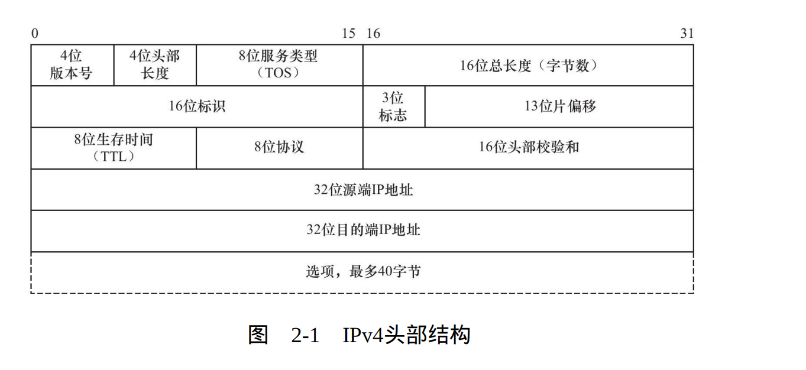
其长度通常为20字节，除非含有可变长的选项部分。

### 版本号(bit) 4bit
```
4位版本号（version）指定IP协议的版本。对IPv4来说，其值是0100。
```
### 头部长度(bit) 4bit
```
4位头部长度（header length）标识该IP头部有多少个32 bit字（4字节）。
4(字节）*5行 = 20字节
而选项最多40字节
可以推出IP头部最长60字节
```
### 服务类型（bit） 8bit
```
8位服务类型（Type Of Service，TOS）包括一个3位的优先权字段（现在已经被忽略），4位的TOS字段和1位保留字段（必须置0）。

4位 的TOS字段分别表示：最小延时，最大吞吐量，最高可靠性和最小费用。其中最多有一个能置为1，应用程序应该根据实际需要来设置它。
比如像ssh和telnet这样的登录程序需要的是最小延时的服务，而文件传输程序ftp则需要最大吞吐量的服务。
```
### 总长度（packet length） 16bit
```
16位总长度（total length）是指整个IP数据报的长度，以字节为单位，因此IP数据报的最大长度为65 535（216-1）字节。
但由于MTU的限制，长度超过MTU的数据报都将被分片传输，所以实际传输的IP数据报（或分片）的长度都远远没有达到最大值。

包括了ip头部和data
```
### 标识符（identification） 16bit
```
16位标识（identification）唯一地标识主机发送的每一个数据报。
其初始值由系统随机生成；每发送一个数据报，其值就加1。该值在数据报分片时被复制到每个分片中，因此同一个数据报的所有分片都具
有相同的标识值。

值1—65535（2^16-1）
```

### 标志（Flags） 3bit
```
标志字段用以指出该IP数据报后面是否还有分段
第一位 R 保留位一般是空的。
第二位 DF（Don’t Fragment）位 不分片位 1表示不分片，0表示分片。
第三位 MF（More Fragment）位 更多分片位 1表示后面还有分片，0表示无。除了数据报的最后一个分片外，其他分片都要把它置1。
```

### 分片偏移（Flag offset） 13bit
```
13位分片偏移（fragmentation offset）是分片相对原始IP数据报开始处（仅指数据部分）的偏移。实际的偏移值是该值左移3位（乘8）
后得到的。

由于这个原因，除了最后一个IP分片外，每个IP分片的数据部分的长度必须是8的整数倍（这样才能保证后面的IP分片拥有一个合适的偏移值）。
```

### 生存时间(Time to live) 8bit
```
8位生存时间（Time To Live，TTL）是数据报到达目的地之前允许经过的路由器跳数。

TTL值被发送端设置（常见的值是64）。
数据报在转发过程中每经过一个路由，该值就被路由器减1。当TTL值减为0时，路由器将丢弃数据报，并向源端发送一个ICMP差错报文。

TTL值可以防止数据报陷入路由循环。
```

### 协议号（protocol） 8bit
```
8位协议（protocol）用来区分上层协议。

/etc/protocols文件定义了所有上层协议对应的protocol字段的数值。其中，ICMP是1，TCP是6，UDP是17。
/etc/protocols文件是RFC 1700的一个子集。
```

### 头部校验和（header checksum） 16bit
```
16位头部校验和（header checksum）由发送端填充，接收端对其使用CRC算法以检验IP数据报头部（注意，仅检验头部）在传输过程
中是否损坏。
```

### 源ip地址（Source address） 32bit
### 目标ip地址（Destination address） 32bit

```
32位的源端IP地址和目的端IP地址用来标识数据报的发送端和接收端。一般情况下，这两个地址在整个数据报的传递过程中保持不变，
而不论它中间经过多少个中转路由器。
```

### 可选项（options）
```
完成一些特殊功能：严格路由 松散路由 记录路由 时间戳只能在options 里面做。
这部分最多包含40字节，因为IP头部最长是60字节（其中还包含前面讨论的20字节的固定部分）。
```

## 使用tcpdump观察IPv4头部结构
### 操作过程如下:
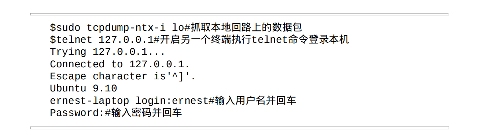
### 用tcpdump抓取数据包:
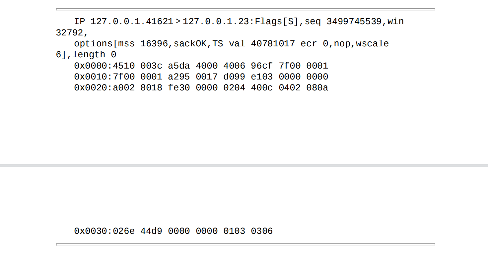
> 这次抓包我们开启了tcpdump的-x选项，使之输出数据包的二进制码。此数据包共包含60字节，其中前20字节是IP头部，后40字节是TCP头部，不包含应用程序数据（length值为0）。
### 分析头部的字节
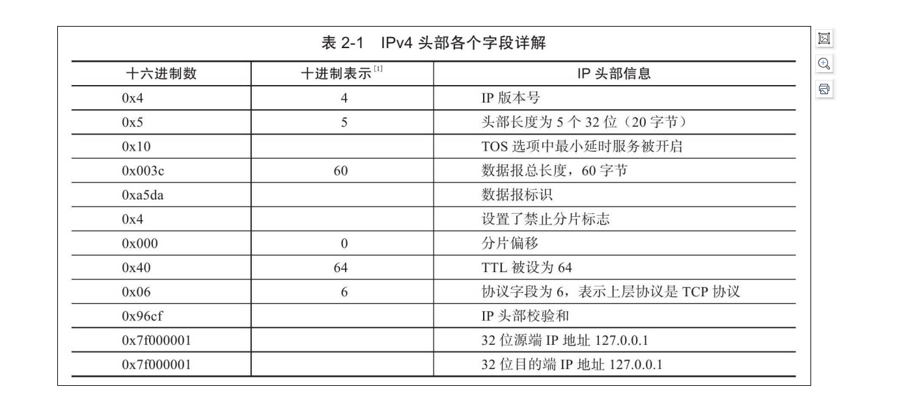
```
0x0000: 4510 003c a5da 4000 4006 96cf 7f00 0001
解析：
	都是16进制，1个16进制是4位，对照下方的表格看
	IP版本号4，头部长度20字节，开启最小延时服务，禁止分片，TTL最多经过64个路由器，上层协议是TCP。
```

# IP分片
> 当IP数据报的长度超过帧的MTU时，它将被分片传
输。分片可能发生在发送端，也可能发生在中转路由器上，而且可能
在传输过程中被多次分片，但只有在最终的目标机器上，这些分片才
会被内核中的IP模块重新组装。

> IP头部中的如下三个字段给IP的分片和重组提供了足够的信息：`数据报标识、
标志和片偏移`。一个IP数据报的每个分片都具有自己的IP头
部，它们具有相同的标识值，但具有不同的片偏移。并且除了最后一
个分片外，其他分片都将设置`MF`标志。此外，每个分片的IP头部的总
长度字段将被设置为该分片的长度。

```
以太网帧的MTU是1500字节（可以通过ifconfig命令或者netstat命令查看），因此它携带的IP数据报的数据部分最多是1480字节（IP头部
占用20字节）。考虑用IP数据报封装一个长度为1481字节的ICMP报文（包括8字节的ICMP头部，所以其数据部分长度为1473字节），则该
数据报在使用以太网帧传输时必须被分片。
```
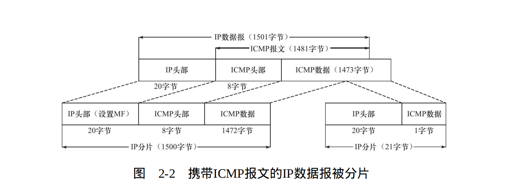
```
  长度为1501字节的IP数据报被拆分成两个IP分片，第一个IP分片长度为1500字节，第二个IP分片的长度为21字节。每个IP分片
都包含自己的IP头部（20字节），且第一个IP分片的IP头部设置了MF标志，而第二个IP分片的IP头部则没有设置该标志，因为它
已经是最后一个分片了。原始IP数据报中的ICMP头部内容被完整地复制到了第一个IP分片中。第二个IP分片不包含ICMP头部信息
，因为IP模块重组该ICMP报文的时候只需要一份ICMP头部信息，重复传送这个信息没有任何益处。1473字节的ICMP报文数据的前
1472字节被IP模块复制到第一个IP分片中，使其总长度为1500字节，从而满足MTU的要求；而多出的最后1字节则被复制到第二个
IP分片中。

  需要指出的是，ICMP报文的头部长度取决于报文的类型，其变化范围很大。图2-2以8字节为例，因为后面的例子用到了ping程序，而
ping程序使用的ICMP回显和应答报文的头部长度是8字节。
```

> 为了看清楚IP分片的具体过程，考虑从ernest-laptop来ping机器Kongming20，每次传送1473字节的数据（这是ICMP报文的数据部分）
以强制引起IP分片，并用tcpdump抓取这一过程中双方交换的数据包。具体操作过程如下：

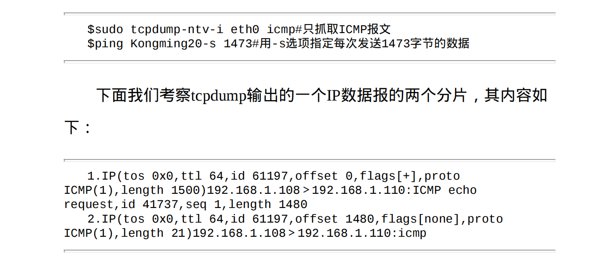
```
这两个IP分片的标识值都是61197，说明它们是同一个IP数据报的分片。

第一个分片的片偏移值为0，而第二个则是1480。很显然，第二个分片的片偏移值实际上也是第一个分片的ICMP报文的长度。
第一个分片设置了MF标志以表示还有后续分片，所以tcpdump输 出“flags[+]”。
而第二个分片则没有设置任何标志，所以tcpdump输 出“flags[none]”。这个两个分片的长度分别为1500字节和21字节。

最后，IP层传递给数据链路层的数据可能是一个完整的IP数据报，也可能是一个IP分片，它们统称为IP分组（packet）。
```

# IP路由
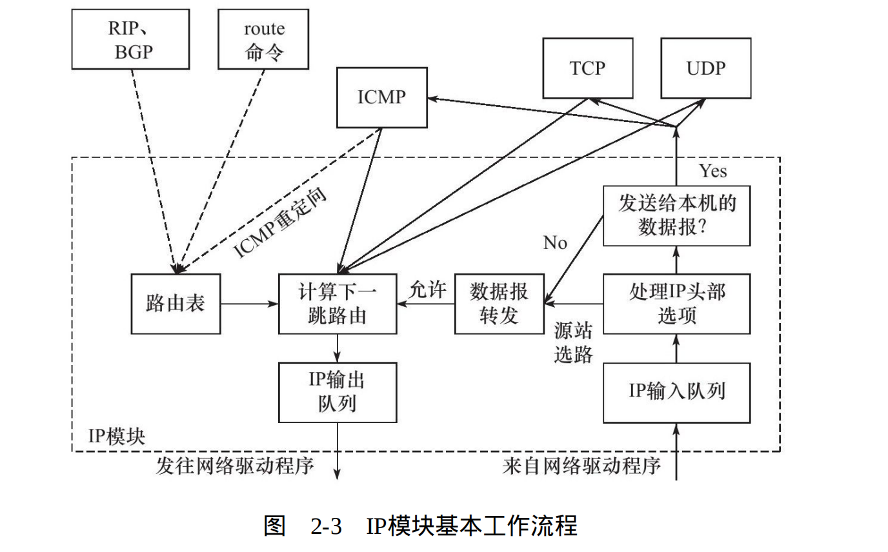

从右往左看：
> 当IP模块接收到来自数据链路层的IP数据报时，它首先对该数据报的头部做CRC校验，确认无误之后就分析其头部的具体信息。

> 如果该IP数据报的头部设置了`源站选路选项`（松散源路由选择或严格源路由选择），则IP模块调用数据报转发子模块来处理该数据报。如果该IP数据报的头部中目标IP地址是本机的某个IP地址，或者是广播地址，即该数据报是发送给本机的，则IP模块就根据数据报头部中的协议字段来决定将它派发给哪个上层应用（分用）。如果IP模块发现这个数据报不是发送给本机的，则也调用数据报转发子模块来处理该数据报。

> IP数据报应该发送至哪个下一跳路由（或者目标机器），以及经过哪个网卡来发送，就是IP路由过程，即图2-3中“计算下一跳路由”子模块。IP模块实现数据报路由的核心数据结构是`路由表`。这个表按照数据报的目标IP地址分类，同一类型的IP数据报将被发往相同的下一跳路由器（或者目标机器）。我们将在后面讨论IP路由过程。

> IP输出队列中存放的是所有等待发送的IP数据报，其中除了需要转发的IP数据报外，还包括封装了本机上层数据（ICMP报文、TCP报文段和UDP数据报）的IP数据报。

> 图2-3中的虚线箭头显示了`路由表更新的过程`。这一过程是指通过路由协议或者route命令调整路由表，使之更适应最新的网络拓扑结构，称为IP路由策略。

## 路由机制
> 要研究IP路由机制，需要先了解路由表的内容。我们可以使用`route`命令或`netstat`命令查看路由表。在测试机器ernest-laptop上执行route命令。

### 路由表实例
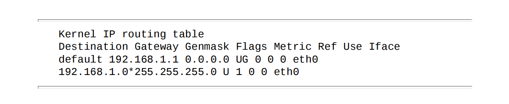

该路由表包含两项，每项都包含8个字段。
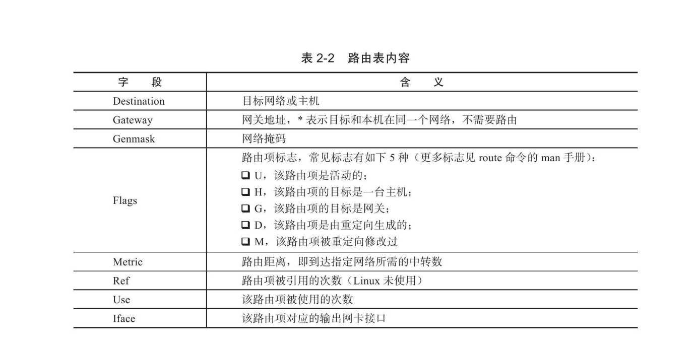
> 第一项的目标地址是default，即所谓的`默认路由项`。该项包含一个“G”标志，说明路由的下一跳目标是网关，其地址是192.168.1.1（这是测试网络中路由器的本地IP地址）。另外一个路由项的目标地址是192.168.1.0，它指的是`本地局域网`。该路由项的网关地址为*，说明数据报不需要路由中转，可以直接发送到目标机器。

那么路由表是如何按照IP地址分类的呢？或者说给定数据报的目标IP地址，它将匹配路由表中的哪一项呢？这就是IP的路由机制，分为
3个步骤：
```
1）查找路由表中和数据报的目标IP地址完全匹配的主机IP地址。
如果找到，就使用该路由项，没找到则转步骤2。

2）查找路由表中和数据报的目标IP地址具有相同网路ID的网络IP
地址（比如代码清单2-2所示的路由表中的第二项）。如果找到，就使
用该路由项；没找到则转步骤3。

3）选择默认路由项，这通常意味着数据报的下一跳路由是网关。
因此，对于测试机器ernest-laptop而言，所有发送到IP地址为
192.168.1.*的机器的IP数据报都可以直接发送到目标机器（匹配路由表
第二项），而所有访问因特网的请求都将通过网关来转发（匹配默认
路由项）。
```

## 路由表更新
> 路由表必须能够更新，以反映网络连接的变化，这样IP模块才能准确、高效地转发数据报。route命令可以修改路由表。我们看如下几个例子（在机器ernest-laptop上执行）：

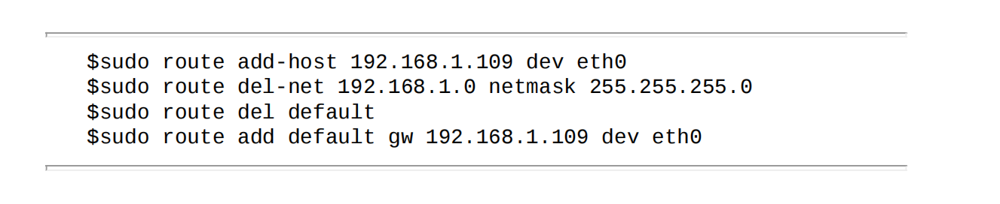

```
第1行表示添加主机192.168.1.109（机器Kongming20）对应的路由项。
这样设置之后，所有从ernest-laptop发送到Kongming20的IP数据报将通过网卡eth0直接发送至目标机器的接收网卡。

第2行表示删除网络192.168.1.0对应的路由项。
这样，除了机器Kongming20外，测试机器ernest-laptop将无法访问该局域网上的任何其他机器（能访问到Kongming20是由于执行了上一条命令）。

第3行表示删除默认路由项，这样做的后果是无法访问因特网。

第4行表示重新设置默认路由项，不过这次其网关是机器Kongming20（而不是能直接访问因特网的路由器）！
经过上述修改后的路由表如下：
```

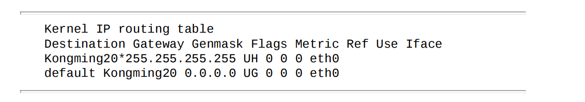
```
这个新的路由表中，第一个路由项是主机路由项，所以它被设置了“H”标志。我们设计这样一个路由表的目的是为后文讨论ICMP重定
向提供环境。

通过route命令或其他工具手工修改路由表，是静态的路由更新方式。对于大型的路由器，它们通常通过BGP（Border Gateway
Protocol，边际网关协议）、RIP（Routing Information Protocol，路由信息协议）、OSPF等协议来发现路径，并更新自己的路由表。这种更新
方式是动态的、自动的。这部分内容超出了本书的讨论范围，感兴趣的读者可阅读参考资料1。
```

# IP转发
> 不是发送给本机的IP数据报将由数据报转发子模块来处理。路由器都能执行数据报的转发操作，而主机一般只发送和接收数据报，这是因为主机上/proc/sys/net/ipv4/ip_forward内核参数默认被设置为0。我们可以通过修改它来使能主机的数据报转发功能（在测试
机器Kongming20上以root身份执行）：


> 对于允许IP数据报转发的系统（主机或路由器），数据报转发子模块将对期望转发的数据报执行如下操作：
```
1）检查数据报头部的TTL值。如果TTL值已经是0，则丢弃该数据报。

2）查看数据报头部的严格源路由选择选项。如果该选项被设置，则检测数据报的目标IP地址是否是本机的某个IP地址。如果不是，则发送一个ICMP源站选路失败报文给发送端。

3）如果有必要，则给源端发送一个ICMP重定向报文，以告诉它一个更合理的下一跳路由器。

4）将TTL值减1。

5）处理IP头部选项。

6）如果有必要，则执行IP分片操作。
```

# 重定向
## ICMP重定向报文
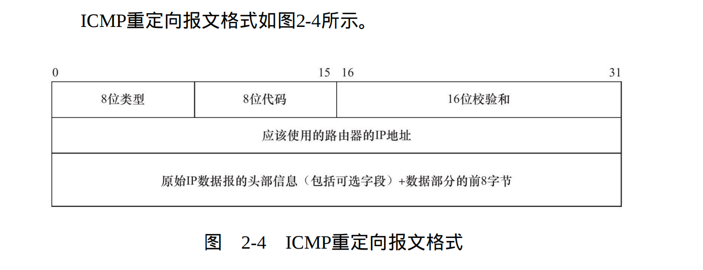
> 过ICMP报文头部的3个固定字段：8位类型、8位代码和16位校验和。ICMP重定向报文的类型值是5，代码字段有4个可选值，用来区分不同的重定向类型。本书仅讨论主机重定向，其代码值为1。

ICMP重定向报文的数据部分含义很明确，它给接收方提供了如下两个信息：
```
1.引起重定向的IP数据报（即图2-4中的原始IP数据报）的源端IP地址。
2.应该使用的路由器的IP地址。
```
```
接收主机根据这两个信息就可以断定引起重定向的IP数据报应该使用哪个路由器来转发，并且以此来更新路由表（通常是更新路由表缓冲，而不是直接更改路由表）。

/proc/sys/net/ipv4/conf/all/send_redirects内核参数指定是否允许发送ICMP重定向报文，而/proc/sys/net/ipv4/conf/all/accept_redirects内核参数则指定是否允许接收ICMP重定向报文。

一般来说，主机只能接收ICMP重定向报文，而路由器只能发送ICMP重定向报文。
```

## 主机重定向实例
我们把机器ernest-laptop的网关设置成了机器
Kongming20，2.5节中我们又使能了Kongming20的数据报转发功能，因此机器ernest-laptop将通过Kongming20来访问因特网，比如在ernest-laptop上执行如下ping命令：
```
$ping www.baidu.com
PING www.a.shifen.com(119.75.217.56)56(84)bytes of data.
From Kongming20(192.168.1.109):icmp_seq=1 Redirect Host(New
nexthop:192.168.1.1)
64 bytes from 119.75.217.56:icmp_seq=1 ttl=54 time=6.78 ms
---www.a.shifen.com ping statistics---
1 packets transmitted,1 received,0%packet loss,time 0ms
rtt min/avg/max/mdev=6.789/6.789/6.789/0.000 ms
```
从ping命令的输出来看，Kongming20给ernest-laptop发送了一个ICMP重定向报文，告诉它请通过192.168.1.1来访问目标机器，因为这对ernest-laptop来说是更合理的路由方式。当主机ernest-laptop收到这样的ICMP重定向报文后，它将更新其路由表缓冲（使用命令route-Cn查看），并使用新的路由方式来发送后续数据报。上面讨论的重定向过程可用图2-5来总结。

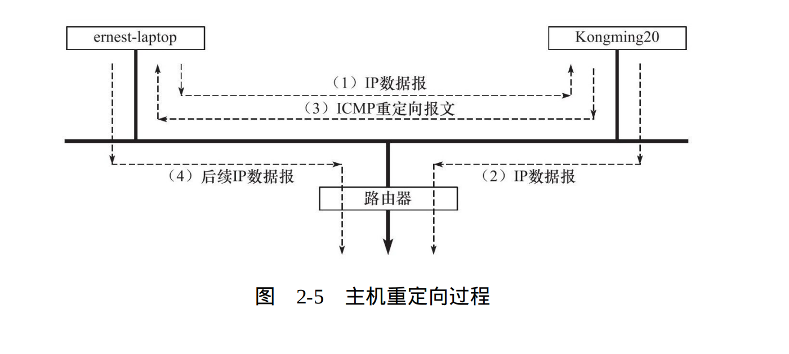

## IPv6头部结构
IPv6头部由40字节的固定头部和可变长的扩展头部组成。
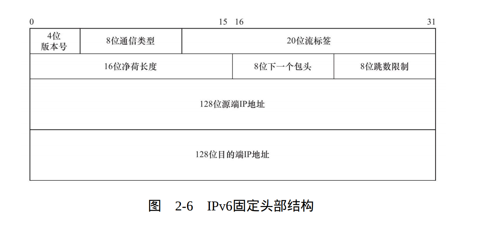

### 版本号(bit) 4bit
```
4位版本号（version）指定IP协议的版本。对IPv6来说，其值是6。
```

### 通信类型(bit) 8bit
```
8位通信类型（traffic class）指示数据流通信类型或优先级，和IPv4中的TOS类似。
```

### 流标签(bit) 20bit
```
20位流标签（flow label）是IPv6新增加的字段，用于某些对连接的服务质量有特殊要求的通信，比如音频或视频等实时数据传输。
```

### 净荷长度(bit) 16bit
```
16位净荷长度（payload length）指的是IPv6扩展头部和应用程序数据长度之和，不包括固定头部长度。
```

### 下一个包头(bit) 8bit
```
8位下一个包头（next header）指出紧跟IPv6固定头部后的包头类型，如扩展头（如果有的话）或某个上层协议头（比如TCP，UDP或ICMP）。它类似于IPv4头部中的协议字段，且相同的取值有相同的含义。
```

### IP地址(bit) 128bit
```
IPv6用128位（16字节）来表示IP地址，使得IP地址的总量达到了2^128个。所以有人说，“IPv6使得地球上的每粒沙子都有一个IP地址”。
```
说明：
```
32位表示的IPv4地址一般用点分十进制来表示，而IPv6地址则用十
六进制字符串表示，比
如“FE80:0000:0000:0000:1234:5678:0000:0012”。可见，IPv6地址
用“:”分割成8组，每组包含2字节。
```

### 零压缩法（省略连续的、全零的组）
```
上面的例子使用零压缩法可表示为“FE80::1234:5678:0000:0012”。
不过零压缩法对一个IPv6地址只能使用一次，比如上面的例子中，
字节组“5678”后面的全零组就不能再省略，否则我们就无法计算每个“::”之间省略了多少个全零组。
```

### IPv6扩展头部
```
可变长的扩展头部使得IPv6能支持更多的选项，并且很便于将来的扩展需要。

它的长度可以是0，表示数据报没使用任何扩展头部。一个数据报可以包含多个扩展头部，每个扩展头部的类型由前一个头部
（固定头部或扩展头部）中的下一个报头字段指定。目前可以使用的扩展头部如表2-3所示。
```
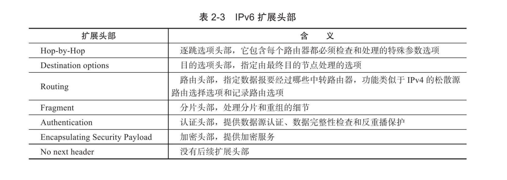

> IPv6协议并不是IPv4协议的简单扩展，而是完全独立的协议。用以太网帧封装的IPv6数据报和IPv4数据报具有不同的类型值。第1章提到，IPv4数据报的以太网帧封装类型值是0x800，而IPv6数据报的以太网帧封装类型值是0x86dd（见RFC 2464）。

