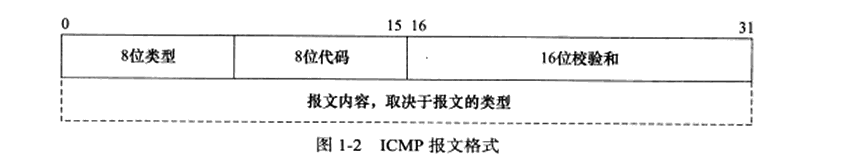
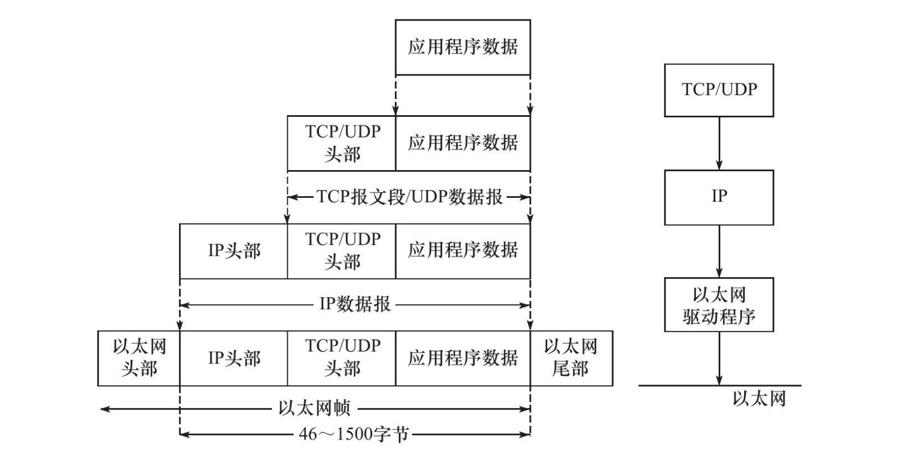
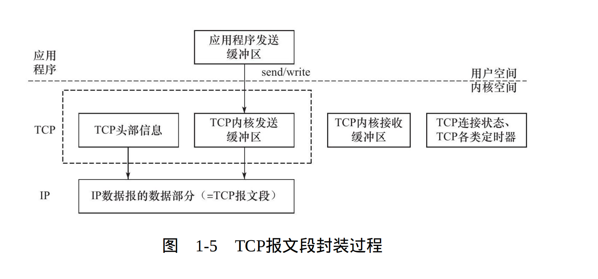
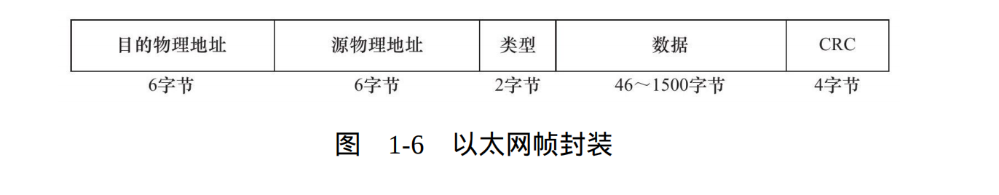
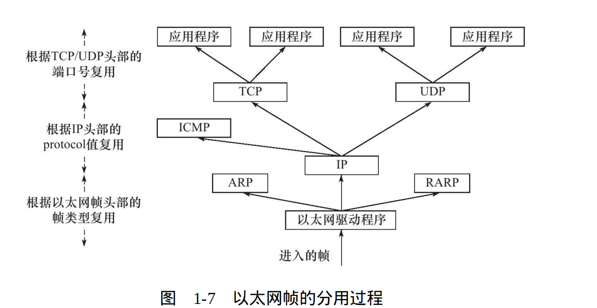
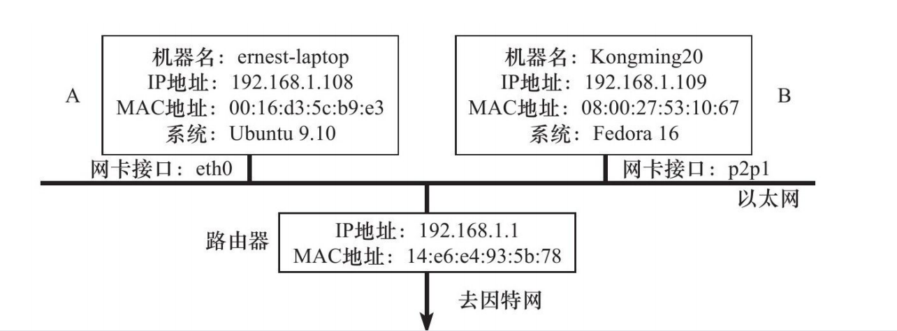

# TCP/IP协议簇以及主要协议
## OSI四层协议
```
1. 数据链路层 -> 第一层
2. 网络层 -> 第二层
3. 传输层 -> 第三层
4. 应用层 -> 第四层
```

## 主要协议
```
应用层	  ping - telent	- OSPF - DNS      用户空间
----------------------------------------- socket
传输层			TCP	- UDP
-----------------------------------------
网络层		    ICMP - IP				  内核空间
-----------------------------------------
数据链路层		ARP - RARP
----------------------------------------- 物理传输媒介
```

### 1.数据链路层
> 数据链路层实现了网卡接口的网络驱动程序，以处理数据在物理媒介(比如以太网、令牌环等）上的传输。常用协议是`ARP(Address Resolve Protocol)`和`RARP(Reverse Address Resolve Protocol)`协议。

### 2. 网络层
> 网络层实现数据包的选路和转发。核心协议是`IP(Internet Protocol)`和`ICMP(Internet Control Message Protocol)`协议。

#### 2.1 ICMP报文格式

```
8位类型字段用于区分报文类型。它将ICMP报文分为两大类：
	
一类是差错报文，这类报文主要用来回应网络错误，比如目标不可到达（类型值为3）和重定向（类型值为5；

另一类是查询报文，这类报文用来查询网络信息，比如ping程序就是使用ICMP报文查看目标是否可到达（类型值为8）的。有的ICMP报文还使用8位代码字
段来进一步细分不同的条件。比如重定向报文使用代码值0表示对网络重定向，代码值1表示对主机重定向。ICMP报文使用16位校验和字段对整个报文（包
括头部和内容部分）进行循环冗余校验（Cyclic Redundancy Check，CRC），以检验报文在传输过程中是否损坏。不同的ICMP报文类型具有不同的正文内
容。

其他ICMP报文格式请参考ICMP协议的标准文档RFC792。

需要指出的是，ICMP协议并非严格意义上的网络层协议，因为它使用处于同一层的IP协议提供的服务（一般来说，上层协议使用下层协议提供的服务）。
```

### 3. 传输层
> 传输层为两台主机上的应用程序提供端到端（end to end）的通信。与网络层使用的逐跳通信方式不同，传输层只关心通信的起始端和目的端，而不在乎数据包的中转过程。核心协议是`TCP协议，UDP协议，SCTP协议`。

#### 3.1 TCP/IP
```
TCP协议（Transmission Control Protocol，传输控制协议）为应用层提供可靠的、面向连接的和基于流（stream）的服务。

TCP协议使用超时重传、数据确认等方式来确保数据包被正确地发送至目的端，因此TCP服务是可靠的。

使用TCP协议通信的双方必须先建立TCP连接，并在内核中为该连接维持一些必要的数据结构，比如连接的状态、读写缓冲区，以及诸多定时器等。
当通信结束时，双方必须关闭连接以释放这些内核数据。

TCP服务是基于流的。基于流的数据没有边界（长度）限制，它源源不断地从通信的一端流入另一端。发送端可以逐个字节地向数据流中写入数据
，接收端也可以逐个字节地将它们读出。
```

#### 3.2 UDP协议
```
UDP协议（User Datagram Protocol，用户数据报协议）则与TCP协议完全相反，它为应用层提供不可靠、无连接和基于数据报的服务。

“不可靠”意味着UDP协议无法保证数据从发送端正确地传送到目的端。如果数据在中途丢失，或者目的端通过数据校验发现数据错误而将其丢弃，
则UDP协议只是简单地通知应用程序发送失败。因此，使用UDP协议的应用程序通常要自己处理数据确认、超时重传等逻辑。

UDP协议是无连接的，即通信双方不保持一个长久的联系，因此应用程序每次发送数据都要明确指定接收端的地址（IP地址等信息）。

基于数据报的服务，是相对基于流的服务而言的。每个UDP数据报都有一个长度，接收端必须以该长度为最小单位将其所有内容一次性读出，否则数据将被截断。
```

#### 3.3 SCTP协议
```
SCTP协议（Stream Control Transmission Protocol，流控制传输协议）是一种相对较新的传输层协议，它是为了在因特网上传输电话信号而设计的。

可参考其标准文档RFC 2960
```

### 4. 应用层
> 应用层负责处理应用程序的逻辑。数据链路层、网络层和传输层负责处理网络通信细节，这部分必须既稳定又高效，因此它们都在内核空间中实现，而应用层则在用户空间实现，因为它负责处理众多逻辑，比如文件传输、名称查询和网络管理等。如果应用层也在内核中实现，则会使内核变得非常庞大。当然，也有少数服务器程序是在内核中实现的，这样代码就无须在用户空间和内核空间来回切换（主要是数据的复制），极大地提高了工作效率。不过这种代码实现起来较复杂，不够灵活，且不便于移植。

#### 4.1 telent 协议
```
telnet协议是一种远程登录协议，它使我们能在本地完成远程任务，本书后续章节将会多次使用telnet客户端登录到其他服务上。
```

#### 4.2 OSPF 协议
```
OSPF（Open Shortest Path First，开放最短路径优先）协议是一种动态路由更新协议，用于路由器之间的通信，以告知对方各自的路由信息。
```

#### 4.3 DNS 协议
```
DNS（Domain Name Service，域名服务）协议提供机器域名到IP地址的转换，我们将在后面简要介绍DNS协议。
```

## 封装
> 每层协议都将在上层数据的基础上加上自己的头部信息（有时还包括尾部信息），以实现该层的功能，这个过程就称为封装。



> 经过TCP封装后的数据称为TCP报文段（TCP message segment），或者简称TCP段。前文提到，TCP协议为通信双方维持一个连接，并且在内核中存储相关数据。这部分数据中的TCP头部信息和TCP内核缓冲区（发送缓冲区或接收缓冲区）数据一起构成了TCP报文段，如下图中的虚线框所示。



> 当发送端应用程序使用send（或者write）函数向一个TCP连接写入数据时，内核中的TCP模块首先把这些数据复制到与该连接对应的TCP内核发送缓冲区中，然后TCP模块调用IP模块提供的服务，传递的参数包括TCP头部信息和TCP发送缓冲区中的数据，即TCP报文段。

> 经过UDP封装后的数据称为UDP数据报（UDP datagram）。UDP对应用程序数据的封装与TCP类似。不同的是，UDP无须为应用层数据保存副本，因为它提供的服务是不可靠的。当一个UDP数据报被成功发送之后，UDP内核缓冲区中的该数据报就被丢弃了。如果应用程序检测到该数据报未能被接收端正确接收，并打算重发这个数据报，则应用程序需要重新从用户空间将该数据报拷贝到UDP内核发送缓冲区中。

> 经过IP封装后的数据称为IP数据报（IP datagram）。IP数据报也包括头部信息和数据部分，其中数据部分就是一个TCP报文段、UDP数据报或者ICMP报文。

> 经过数据链路层封装的数据称为帧（frame）。

### 以太网帧


```
帧的最大传输单元（Max Transmit Unit，MTU），即帧最多能携带多少上层协议数据（比如IP数据报），通常受到网络类型的限制。
图1-6所示的以太网帧的MTU是1500字节。
```

## 分用
> 当帧到达目的主机时，将沿着协议栈自底向上依次传递。各层协议依次处理帧中本层负责的头部数据，以获取所需的信息，并最终将处理后的帧交给目标应用程序。这个过程称为分用（demultiplexing）。分用是依靠头部信息中的类型字段实现的。



## 测试网络
> 测试网络两台主机A和B，以及一个连接到因特网的路由器。



## socket
> 数据链路层、网络层、传输层协议是在内核中实现的。因此操作系统需要实现一组系统调用，使得应用程序能够访问这些协议提供的服务。实现这组系统调用的API（ApplicationProgramming Interface，应用程序编程接口）主要有两套：socket和XTI。

> 由socket定义的这一组API提供如下两点功能：一是将应用程序数据从用户缓冲区中复制到TCP/UDP内核发送缓冲区，以交付内核来发送数据（比如图1-5所示的send函数），或者是从内核TCP/UDP接收缓冲区中复制数据到用户缓冲区，以读取数据；二是应用程序可以通过它们来修改内核中各层协议的某些头部信息或其他数据结构，从而精细地控制底层通信的行为。

> 值得一提的是，socket是一套通用网络编程接口，它不但可以访问内核中TCP/IP协议栈，而且可以访问其他网络协议栈（比如X.25协议栈、UNIX本地域协议栈等）